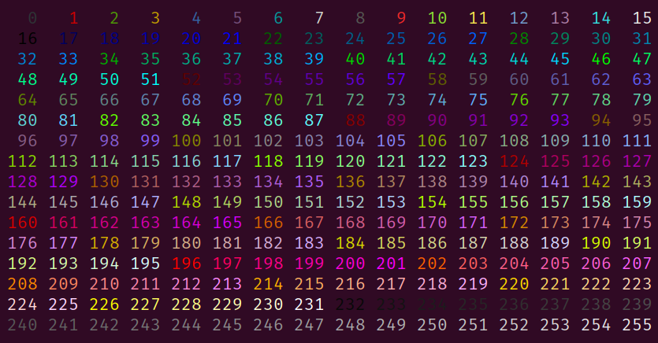

# termkolors
[](https://travis-ci.com/raniejade/termkolors)

The following
```kotlin
import termkolors.Term256
import termkolors.invoke

fun main() {
    with(Term256) {
        for (i in 0..15) {
            for (j in 0..15) {
                val code = i * 16 + j
                print(color(code)("$code".padStart(4)))
            }
            println()
        }
    }
}
```
will output:



